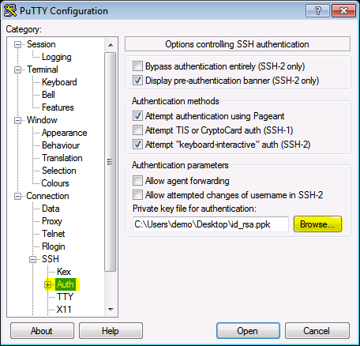

# SSH Access

You must be connected to the Illinois VPN.

Linux/OSX:

    ssh [user]@tikhonov.csl.illinois.edu
    
Windows (using [putty](https://www.chiark.greenend.org.uk/~sgtatham/putty/latest.html)):

Enter `tikhonov.csl.illinois.edu` for the Host Name.

## Accessing Files Natively

### Linux

In the Nautilus file manager:

1. Other Locations > Connect to Server
2. Enter `ssh://[user]@tikhonov.csl.illinois.edu`

Or in commandline:

    mkdir ~/tikhonov
    sshfs -o reconnect [user]@tikhonov.csl.illinois.edu: ~/tikhonov
    
### OSX

Try [sshfs-gui](https://github.com/dstuecken/sshfs-gui)

Or in commandline:

    brew install sshfs
    mkdir ~/tikhonov
    sshfs -o reconnect [user]@tikhonov.csl.illinois.edu: ~/tikhonov

### Windows

Install these packages

- WinSfp - https://github.com/billziss-gh/winfsp/releases
- SSHFS-Win - https://github.com/billziss-gh/sshfs-win/releases

Open File Explorer and browse to `\\sshfs.r\[user]@tikhonov.illinois.edu`

## Creating SSH Keys

### Linux/OSX

    ssh-keygen
    
You can accept the default options.  Your public key located in `$HOME/.ssh/id_rsa.pub` should be shared with the admin prior to logging in.

### Windows

1. Open `puttygen.exe`
2. Click `Generate` and wiggle mouse around.
3. Save the public key `C:/Users/[Username]/id_rsa.pub` and private key to `C:/Users/[Username]/id_rsa.ppk`

Share the public key in `C:/Users/[Username]/id_rsa.pub`

Next time you log in with Putty, you may choose your ssh private key:
1. Connection > SSH > Auth 
2. Choose Browse and select your private key in `C:/Users/[Username]/id_rsa.ppk`

